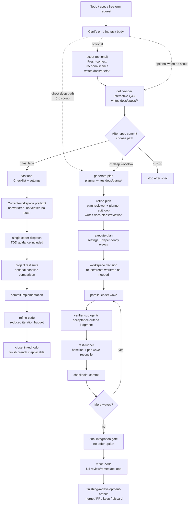

# pi-config

Personal configuration for [pi](https://github.com/badlogic/pi-mono)'s coding agent.

This repository is the checked-in part of my pi setup: project-level agent guidance, local skills, local subagent definitions, local extension code, themes, settings, model-tier routing, and durable workflow artifacts under `docs/`. The emphasis is an opinionated artifact-driven development workflow built on top of stock pi rather than a fork of pi itself.

## Repository layout

```text
agent/
  AGENTS.md          Global/project agent guidance used by this config
  agents/            Local fresh-context subagent definitions (10 agents)
  extensions/        Local TypeScript extension modules and tests
  skills/            Project workflow and discipline skills (16 skills)
  themes/            Custom themes (currently nord)
  model-tiers.json   Tier-to-model map plus provider-to-CLI dispatch map
  settings.json      Main pi settings for this setup
  working.json       Working-indicator configuration used by working extension code
  package.json       Extension/helper-script lint, typecheck, and test scripts

docs/
  todos/             File-backed todos tracked in git
  specs/             Specs written by define-spec
  briefs/            Scout briefs, created on demand by scout
  plans/             Implementation plans and plan review artifacts
  reviews/           Code review artifacts
  test-runs/         Temporary test-runner / fastlane evidence, created on demand
```

Ignored local state includes `.worktrees/`, `agent/auth.json`, `agent/run-history.jsonl`, `agent/sessions/`, `agent/node_modules/`, Python caches, and macOS `.DS_Store` files.

## Configuration facts

### Model tiers

Skills resolve tiers through `agent/model-tiers.json` instead of hard-coding model IDs:

| Tier | Model |
| --- | --- |
| `capable` | `anthropic/claude-opus-4-7` |
| `standard` | `anthropic/claude-sonnet-4-6` |
| `cheap` | `anthropic/claude-haiku-4-5` |
| `crossProvider.capable` | `openai-codex/gpt-5.5` |
| `crossProvider.standard` | `openai-codex/gpt-5.4` |
| `crossProvider.cheap` | `openai-codex/gpt-5.4-mini` |

The dispatch map routes `anthropic` models through `claude` and `openai-codex` models through `pi`. The default interactive session in `agent/settings.json` is `openai-codex/gpt-5.5` with `high` thinking.

### Loaded packages

`agent/settings.json` currently loads:

- `~/Code/pi-interactive-subagent` — local subagent orchestration tools (`subagent`, `subagent_run_serial`, `subagent_run_parallel`, completion watching, pane/headless dispatch).
- `npm:pi-ghostty` — Ghostty integration.
- `npm:pi-mcp-adapter` — MCP gateway integration.
- `npm:pi-web-access` — web search/fetch/browser-adjacent tools and web research skills.
- `npm:@aliou/pi-processes` — managed background-process tool and process skill.

### Enabled local extension

`agent/settings.json` currently enables `./extensions/env.ts`, which sets `PI_TODO_PATH` to `<git-root>/docs/todos` when the variable is not already set. Other local extension modules are kept in the repo with tests and can be enabled as needed.

## Development workflow

The core workflow is artifact-driven: todos, briefs, specs, plans, reviews, test-run artifacts, and git commits are the state passed between fresh-context agents.



Important routing rules:

- `scout` is optional and explicit. When a scout brief is used, it flows into `define-spec`; there is no direct scout-brief-to-plan dispatch. The resulting spec carries the `Scout brief:` provenance line that downstream planners and reviewers read from disk.
- `define-spec` is optional for the no-scout deep path because `generate-plan` accepts todo IDs, spec/design paths, or freeform text. It is still the preferred input shaper for work that needs user Q&A.
- After a spec is committed, `define-spec` offers three choices: `(f) fast lane`, `(d) deep workflow`, or `(x) stop`. Its recommendation is advisory and can be overridden.
- `fastlane` is for well-scoped changes. It keeps spec discipline and a fresh-context `refine-code` pass, but intentionally drops worktree creation, wave decomposition, verifier dispatch, automatic baseline reconciliation, and automatic push.
- The deep workflow (`generate-plan` → `refine-plan` → `execute-plan`) is for broader, riskier, or multi-part work. It uses plan review/edit loops, dependency-ordered waves, per-task verification, `test-runner` artifacts, checkpoint commits, and a final review/remediation loop.

## Skills in this repository

Skills live under `agent/skills/`. They fall into three broad groups: workflow orchestrators, quality/review disciplines, and environment-specific helpers.

| Skill | Role |
| --- | --- |
| [`scout`](agent/skills/scout/README.md) | Optional non-interactive reconnaissance. Dispatches the `scout` subagent, writes a structured brief to `docs/briefs/`, gates that file on user review/commit, and on todo inputs offers to continue to `define-spec`. |
| [`define-spec`](agent/skills/define-spec/README.md) | Interactive spec writing from a todo, existing spec, or freeform request. Uses a mux-backed `spec-designer` pane when available, falls back inline, writes `docs/specs/*.md`, gates commit on review, then offers fastlane/deep/stop. |
| [`fastlane`](agent/skills/fastlane/README.md) | Lightweight implementation path after spec shaping. Accepts a spec path or `TODO-<id>`, builds an ephemeral checklist, dispatches one `coder`, runs tests with optional baseline comparison, commits, invokes reduced-budget `refine-code`, closes linked todos, and never pushes automatically. |
| [`generate-plan`](agent/skills/generate-plan/README.md) | Creates an execution-ready plan from a todo, artifact path, or freeform request. Dispatches `planner`, validates the plan handoff, then hands off to `refine-plan`; it does not own the review loop itself. |
| [`refine-plan`](agent/skills/refine-plan/README.md) | Iterative plan review/edit loop. Dispatches `plan-refiner`, which alternates `plan-reviewer` and planner edit passes, writes era-versioned reviews under `docs/plans/reviews/`, and returns approval status. The skill owns the plan/review commit gate. |
| [`execute-plan`](agent/skills/execute-plan/README.md) | Deep implementation engine for structured plans. Handles workspace/worktree choice, settings, dependency waves, parallel `coder` dispatch, `verifier` acceptance checks, `test-runner` baseline/reconcile gates, checkpoint commits, final integration gate, optional `refine-code`, todo closure, and branch finishing. |
| [`refine-code`](agent/skills/refine-code/README.md) | Iterative code review/remediation over an explicit `BASE_SHA..HEAD_SHA` range. Dispatches `code-refiner`, which runs cross-provider `code-reviewer` passes, batches fixes to `coder`, commits remediations, and writes versioned artifacts under `docs/reviews/`. |
| [`requesting-code-review`](agent/skills/requesting-code-review/README.md) | Standalone fresh-context review request for a git diff. Dispatches `code-reviewer`, parses `Approved` / `Approved with concerns` / `Not approved`, and applies the severity policy. |
| [`receiving-code-review`](agent/skills/receiving-code-review/README.md) | Discipline for handling review feedback: understand the feedback, verify it against code reality, clarify ambiguity, push back when technically wrong, and implement one item at a time. |
| [`commit`](agent/skills/commit/README.md) | Focused Conventional Commits helper. Reviews status/diff, respects requested paths or globs, asks about ambiguous unrelated files, stages only intended changes, commits, and does not push. |
| [`test-driven-development`](agent/skills/test-driven-development/README.md) | Red-green-refactor discipline for behavior changes. Requires public-interface tests, observing the expected red failure before implementation, minimal green changes, and refactoring only while green. |
| [`systematic-debugging`](agent/skills/systematic-debugging/README.md) | Root-cause-first debugging process for bugs, test failures, and unexpected behavior. Uses investigation, pattern analysis, hypothesis testing, and a three-fix escalation rule before implementation. |
| [`verification-before-completion`](agent/skills/verification-before-completion/README.md) | Evidence-before-claims gate. Before saying work is complete/fixed/passing, run or inspect the verification that proves that exact claim and read the full output. |
| [`using-git-worktrees`](agent/skills/using-git-worktrees/README.md) | Manual worktree setup and safety checks. Chooses a worktree root, verifies project-local roots are ignored, creates a feature branch worktree, auto-detects setup, and runs baseline tests. |
| [`finishing-a-development-branch`](agent/skills/finishing-a-development-branch/README.md) | End-of-branch workflow after tests pass. Offers exactly four paths: merge locally, push/create PR, keep as-is, or discard with typed confirmation; cleans worktrees only when safe. |
| [`web-browser`](agent/skills/web-browser/README.md) | Chrome/Chromium CDP workflow for navigation, screenshots, DOM evaluation, element picking, cookie dismissal, and console/network inspection. |

Shared support files under `agent/skills/_shared/` are not top-level skills, but they are important infrastructure: model-tier resolution, artifact-handoff parsing, test-runner dispatch, integration-test reconciliation, workspace status, and cleanup helpers.

## Local subagents

Local agent definitions live in `agent/agents/`. They use fresh context (`session-mode: lineage-only`) so substantive handoffs happen through files, git diffs, and explicit prompt templates rather than inherited chat history.

| Agent | Used by | Summary |
| --- | --- | --- |
| `scout` | `scout` | Read-only reconnaissance agent except for one brief write. Performs broad orientation, task deep dive, disconfirmation, and emits a `BRIEF_ARTIFACT` marker. |
| `spec-designer` | `define-spec` | Interactive spec designer running in a pane when possible. Conducts Q&A, writes one `docs/specs/*.md` artifact, emits `SPEC_ARTIFACT`, and does not implement. |
| `planner` | `generate-plan`, `refine-plan` | Deep codebase planning agent. Writes structured plans and performs surgical plan edits when review findings require changes. |
| `plan-reviewer` | `refine-plan` | Independent plan reviewer checking structure, requirement coverage, dependencies, testability, and buildability. |
| `plan-refiner` | `refine-plan` | Coordinator for plan review/edit eras. Dispatches reviewers and planner edit passes, validates artifacts, and reports status without committing. |
| `coder` | `execute-plan`, `fastlane`, `refine-code` | Self-contained implementation worker for one plan task, one fastlane checklist, or a batch of review fixes. Reports typed status. |
| `verifier` | `execute-plan` | Per-task acceptance judge. Executes command-style `Verify:` recipes verbatim, inspects the verifier-visible file set, and returns PASS/FAIL per criterion. |
| `test-runner` | `execute-plan` | Thin runner for one integration test command. Captures raw output, stable failing identifiers, non-reconcilable failures, and emits `TEST_RESULT_ARTIFACT`. |
| `code-reviewer` | `requesting-code-review`, `refine-code` | Independent production-readiness reviewer for full diffs or remediation-only re-reviews. Writes/returns verdicts with calibrated severity. |
| `code-refiner` | `refine-code`, `fastlane`, `execute-plan` | Review/remediate coordinator. Dispatches reviewers and coders, batches findings, commits remediations, tracks budget, and writes review artifacts. |

## Local extension modules

The repo tracks several TypeScript extension modules under `agent/extensions/`. Only `env.ts` is currently enabled by `agent/settings.json`; the others are maintained local modules/tests that can be enabled by settings or copied into another profile.

| Module | Purpose |
| --- | --- |
| `env.ts` | Active extension. Sets `PI_TODO_PATH` to this repo's `docs/todos` by default. |
| `answer.ts` | `/answer` flow for extracting and answering assistant questions. |
| `context.ts` | `/context` overview of prompt/context, tools, extensions, skills, tokens, and cost. |
| `files.ts` | Interactive file picker and file actions. |
| `footer.ts` | Theme-aware custom footer renderer. |
| `guardrails.ts` | Tool-call guardrails for sensitive writes, dangerous shell commands, lockfiles, generated files, and unsafe browser navigation. |
| `session-breakdown.ts` | Session-history analytics over `~/.pi/agent/sessions`. |
| `todos.ts` | File-backed todo tool and TUI workflow over `docs/todos/`. |
| `usage-bar.ts` | Provider usage/rate-limit dashboard. |
| `working/` | Working-message and indicator rendering helpers driven by `agent/working.json`. |

## Themes

`agent/themes/nord.json` is the tracked custom theme and is the active theme in `agent/settings.json`.

## Development

The `agent/` directory has the development tooling for local extensions and helper scripts:

```bash
cd agent
npm run lint          # eslint over extensions/**/*.ts
npm run typecheck     # tsc --noEmit
npm run build         # lint + typecheck
npm test              # extension tests via Node's test runner
npm run test:helpers  # Python helper-script test suites
npm run check         # build + extension tests + helper tests
```

## Project-level agent guidance

`agent/AGENTS.md` defines the default operating mode for this setup: match the requested scope, avoid premature abstraction, validate at boundaries, test observable behavior, prefer real internal collaborators over mocks, use TDD for non-trivial behavior changes, and resolve model/tool names explicitly before subagent dispatch.

## What is not in this repo

This repo does not contain the entire personal pi installation. Some behavior comes from globally or locally installed packages, especially the `pi-interactive-subagent` local checkout at `~/Code/pi-interactive-subagent`, package code from npm, user-level authentication/session files, and any global pi keybindings outside this project.

## Design direction

- Keep pi itself minimal and configure behavior externally.
- Prefer durable artifacts over hidden conversation state.
- Use fresh-context subagents with self-contained prompts for independence and reproducibility.
- Route work through the lightest workflow that still preserves the right guardrails.
- Make verification explicit: specs before plans, reviews before execution, tests before completion claims, and branch cleanup only after evidence supports it.
